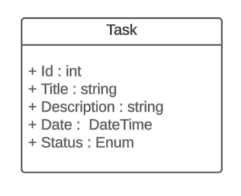
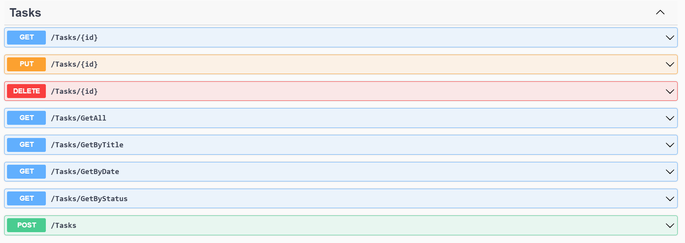

# DIO - .NET Track - API and Entity Framework
www.dio.me

## Project Challenge
For this challenge, you will need to use the knowledge acquired in the API and Entity Framework module of the .NET track at DIO.

## Context
You need to build a task management system where you can create a list of tasks to better organize your routine.

This task list needs to have CRUD operations, meaning it should allow you to retrieve, create, save, and delete records.

Your application should be a Web API or MVC, feel free to implement the solution that you find most suitable.

Your main class, the task class, should be as follows:



Don't forget to generate your migration for database updates.

## Expected Methods
It is expected that you create your methods as follows:


**Swagger**





**Endpoints**


| Ver    | Endpoint                | Parameter | Body          |
|--------|-------------------------|-----------|---------------|
| GET    | /Task/{id}              | id        | N/A           |
| PUT    | /Task/{id}              | id        | Schema Task   |
| DELETE | /Task/{id}              | id        | N/A           |
| GET    | /Task/GetAll            | N/A       | N/A           |
| GET    | /Task/GetByTitle        | title     | N/A           |
| GET    | /Task/GetByDate         | data      | N/A           |
| GET    | /Task/GetByStatus       | status    | N/A           |
| POST   | /Task                   | N/A       | Schema Task   |

This is the schema (model) for Task, used to pass to methods that require it:

```json
{
  "id": 0,
  "title": "string",
  "description": "string",
  "date": "2022-06-08T01:31:07.056Z",
  "status": "Pending"
}
```


## Solution
The code is halfway done, and you should continue following the rules described above so that, in the end, we have a functional program. Look for the commented word "TODO" in the code, then implement according to the rules above.